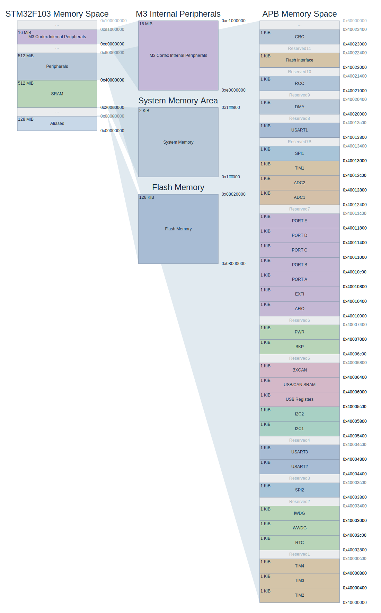
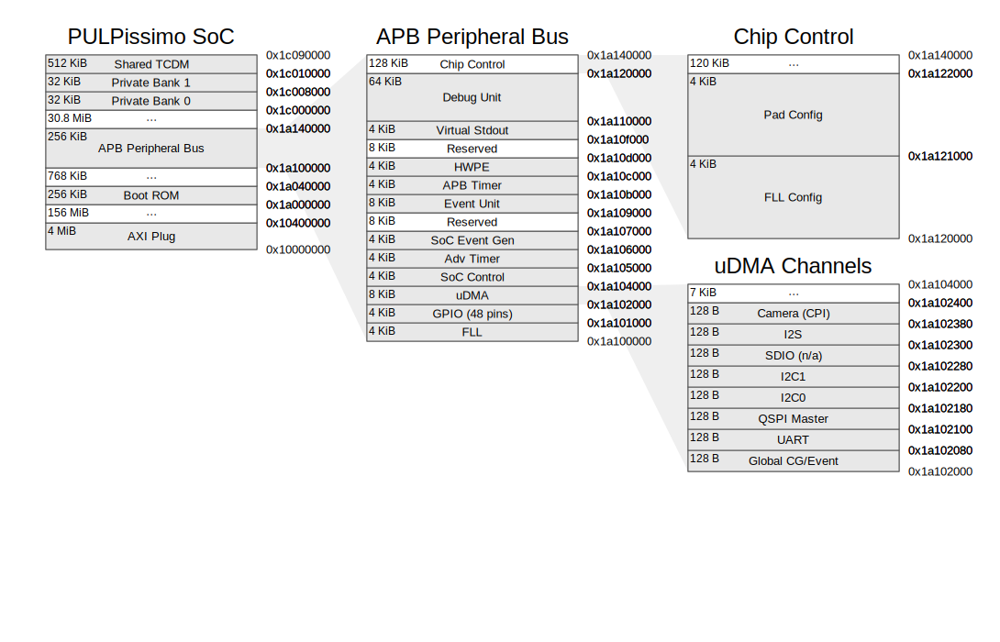
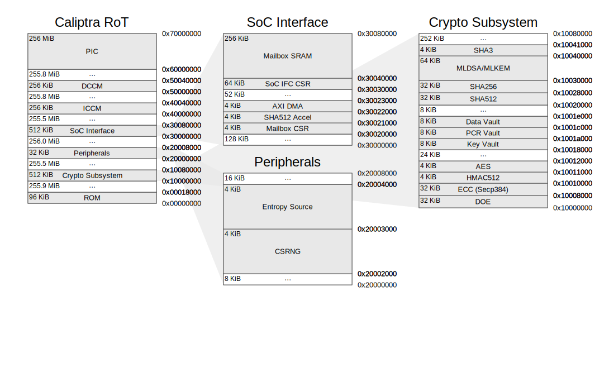
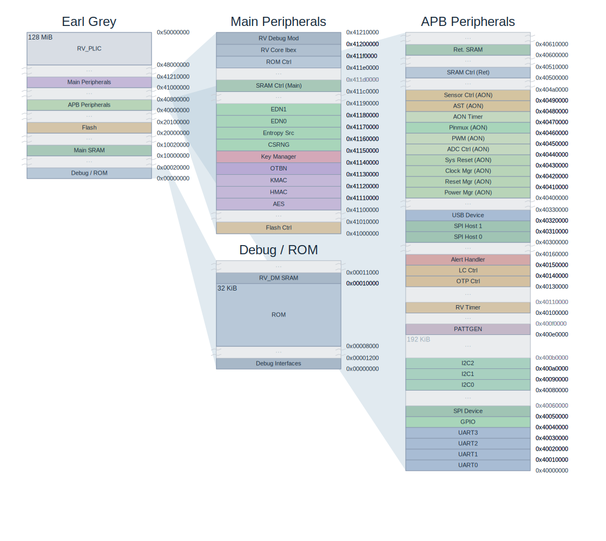

# mmpviz

Turn a JSON memory map into a publication-quality SVG diagram — in one command, with zero dependencies.

```bash
python scripts/mmpviz.py -d diagram.json -t theme.json -o map.svg
```

---

## What is this?

Embedded systems have memory maps — address ranges for Flash, SRAM, peripherals, security subsystems — but communicating them clearly is hard. Datasheets use cramped tables. Hand-drawn diagrams go stale. Most drawing tools make you place every box by hand.

**mmpviz** takes a JSON description of your memory layout and generates a structured SVG that you can drop into documentation, presentations, or datasheets. The layout engine computes positions automatically from address ranges: just describe the addresses and let the tool draw.

---

## Examples

### STM32F103 — ARM Cortex-M3

Five linked panels: full address space overview, Flash zoom, System Memory, APB peripheral bus, and M3 internal peripherals. Every `Reserved` gap is compressed to a break. Links connect the top-level overview to each detail panel.



```bash
python scripts/mmpviz.py \
  -d examples/chips/stm32f103/diagram.json \
  -t examples/chips/stm32f103/theme.json \
  -o stm32.svg
```

---

### PULPissimo RISC-V SoC — four-level zoom

SoC overview → APB peripheral bus → Chip Control detail → uDMA channel breakdown. Each level is a separate panel linked by zoom bands. The uDMA panel shows individual channel registers at 128-byte granularity.



---

### Caliptra Root-of-Trust

RISC-V security subsystem with separate panels for ROM, Crypto Subsystem, Peripherals, SoC Interface, ICCM, and DCCM — each independently color-coded via theme overrides.



---

### OpenTitan Earl Grey — 65+ peripherals

Full TL-UL crossbar SoC with 71 sections across four panels. Auto-layout fits the entire peripheral address space without manual positioning.



---

## Key features

- **Auto-layout** — omit `pos`/`size` entirely. The tool builds a containment graph, assigns panels to columns by depth, and sizes each panel so every section is readable. Canvas grows to fit. Three layout algorithms are available via `--layout algo1|algo2|algo3` (algo3 is the default; it rebalances column heights to keep the canvas aspect ratio near 1:1 and routes non-adjacent links through crossing-free bridge lines).
- **Multi-level zoom** — link panels together with address-matched zoom bands. Drill from a 4GB overview down to 128-byte register blocks.
- **Break compression** — mark sparse address gaps as `"break"` sections. They collapse to a thin separator; the remaining panel height is redistributed proportionally.
- **Growth arrows** — annotate stack/heap regions with directional arrows via `"grows-up"` / `"grows-down"` flags.
- **Address labels** — attach annotated leader lines to any address, on either side of the panel, in any direction.
- **Per-section colors** — full visual control through `theme.json` without touching diagram data. Two built-in themes: `default`, `plantuml`. Custom themes can inherit from any built-in with `"extends"`.
- **Auto-hide** — address, name, and size labels suppress themselves when a section is too small to fit them.
- **No dependencies** — Python 3 stdlib only. No pip, no venv, no build step.

---

## Quick start

**1. Get the tool**

```bash
git clone https://github.com/f33lgood/mmpviz
cd mmpviz
```

**2. Run an example**

```bash
python scripts/mmpviz.py \
  -d examples/chips/stm32f103/diagram.json \
  -t examples/chips/stm32f103/theme.json \
  -o map.svg
```

Open `map.svg` in any browser or SVG viewer.

**3. Build your own**

Create `diagram.json` with your memory regions:

```json
{
  "views": [
    {
      "id": "flash-view",
      "title": "Flash Memory",
      "sections": [
        { "id": "code",   "address": "0x08000000", "size": "0x09000", "name": "Code",       "flags": ["grows-up"] },
        { "id": "consts", "address": "0x08009000", "size": "0x02000", "name": "Const Data"  }
      ]
    },
    {
      "id": "sram-view",
      "title": "SRAM",
      "sections": [
        { "id": "bss",   "address": "0x20000000", "size": "0x00800", "name": ".bss"                     },
        { "id": "stack", "address": "0x20004000", "size": "0x01000", "name": "Stack", "flags": ["grows-down"] }
      ]
    }
  ]
}
```

```bash
python scripts/mmpviz.py -d diagram.json -o map.svg
```

That is all — `pos`, `size`, and `theme.json` are optional. The layout engine handles column placement and panel sizing automatically.

---

## How it works

Two inputs, one output:

| File | Purpose |
|------|---------|
| `diagram.json` | **What** to draw — sections, addresses, flags, area definitions, links |
| `theme.json` | **How** it looks — colors, fonts, per-section overrides |
| `map.svg` | Output — self-contained SVG, renders in any browser |

The `id` field in `diagram.json` sections is the key that connects data to theme overrides. Sections without a theme entry use the area default, which falls back to the global default.

Schema validation and layout checks run automatically before every render. `[ERROR]` issues abort the render; `[WARNING]` issues are printed but SVG is still written.

---

## Examples index

**Chip diagrams**

| Example | Description |
|---------|-------------|
| `examples/chips/stm32f103/` | STM32F103 ARM Cortex-M3 — 5-panel map with APB peripheral detail |
| `examples/chips/caliptra/` | Caliptra RoT RISC-V security subsystem — six color-coded panels |
| `examples/chips/opentitan_earlgrey/` | OpenTitan Earl Grey TL-UL SoC (65+ peripherals) |
| `examples/chips/pulpissimo/` | PULP RISC-V SoC — four-level zoom with µDMA channel detail |
| `examples/chips/riscv64_virt/` | RISC-V 64-bit virtual machine memory map |
| `examples/chips/arm_coresight_dual_view/` | ARM CoreSight — dual-initiator view with connector links |

**Link style**

| Example | Description |
|---------|-------------|
| `examples/link/connector/` | Connector format — trapezoid ends + S-curve center line |
| `examples/link/band_fill/` | Band format — filled straight trapezoid |
| `examples/link/band_stroke/` | Band format — dashed stroke outline, no fill |
| `examples/link/band_segments/` | Band format — three explicit segments with matching junctions |
| `examples/link/anchor_addr_range/` | Explicit `["0xSTART", "0xEND"]` address-range anchors |
| `examples/link/anchor_cross_addr/` | Cross-address mapping — band endpoints at different addresses |
| `examples/link/anchor_to_section/` | `to.sections` pin — destination anchored independently of source |

**Layout**

| Example | Description |
|---------|-------------|
| `examples/layout/column_order/` | DAG-tree column ordering and crossing minimisation |
| `examples/layout/height_override/` | Per-section `min_height` / `max_height` |
| `examples/layout/height_global/` | Global `min_section_height` / `max_section_height` via `theme.json` |

**Diagram primitives**

| Example | Description |
|---------|-------------|
| `examples/diagram/break/` | Break section compression |
| `examples/diagram/labels/` | Address label styles — `in`, `out`, and bidirectional arrows on both sides |

**Stack layout**

| Example | Description |
|---------|-------------|
| `examples/stack/basic/` | Basic Cortex-M SRAM layout — heap and stack with growth arrows |
| `examples/stack/guard_page/` | MPU stack guard page — used/free split, no-access guard region |
| `examples/stack/shadow_stack/` | Shadow stack — return-address-only region alongside the main call stack |

**Themes**

| Example | Description |
|---------|-------------|
| `examples/themes/section_styles/` | Per-section `fill` overrides via `views[id].sections[id]` in `theme.json` |
| `examples/themes/per_link/` | Per-link `fill`/`opacity` overrides via `links.overrides` in `theme.json` |

Built-in themes in `themes/`: `default.json` (auto-loaded), `plantuml.json`

---

## Reference documentation

| File | Contents |
|------|----------|
| `references/create-diagram.md` | Step-by-step authoring guide |
| `references/diagram-schema.md` | All `diagram.json` fields, types, and defaults |
| `references/theme-schema.md` | All `theme.json` style properties; examples and tips |
| `references/auto-layout-algorithm.md` | Auto-layout implementation reference: algo1 (one column per DAG level), algo2 (height-rebalancing, default), algo3 (algo2 + routing lanes for non-adjacent links) |
| `references/check-rules.md` | Validation rules and remediation |

---

## Testing

```bash
python -m pytest tests/
```

Covers section flags, loader, theme resolution, pixel math, SVG builder, renderer integration, auto-layout column assignment, and golden-file regression (all examples re-rendered and diffed against stored reference SVGs).

---

## AI agent skill

See `SKILL.md` for details. Install with:

```bash
ln -s "$(pwd)" ~/.claude/skills/mmpviz
```
