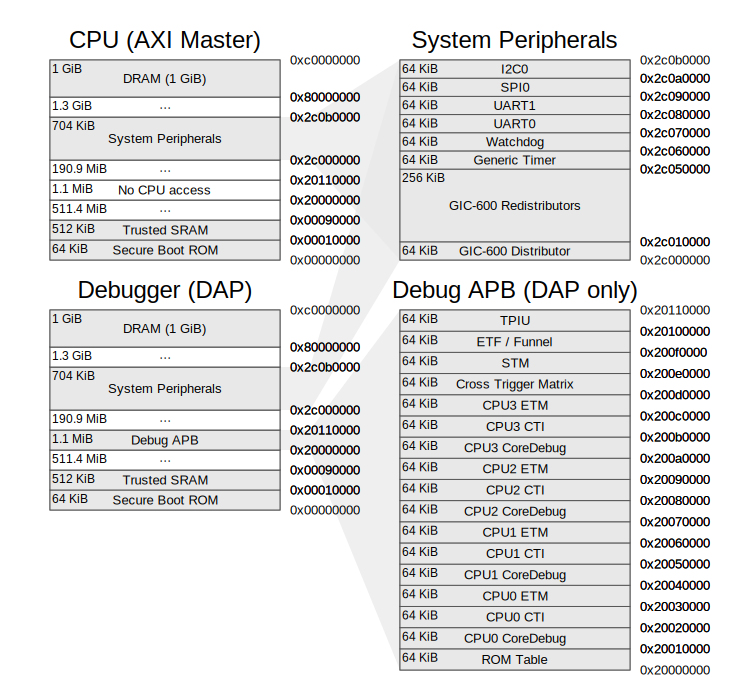
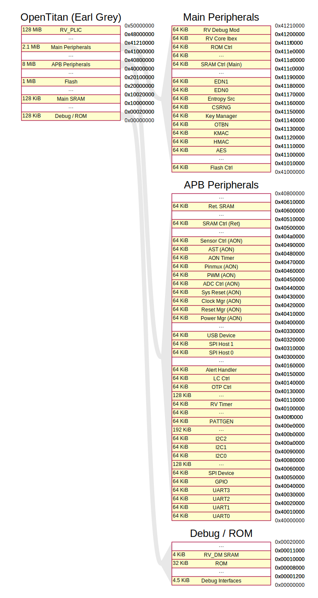
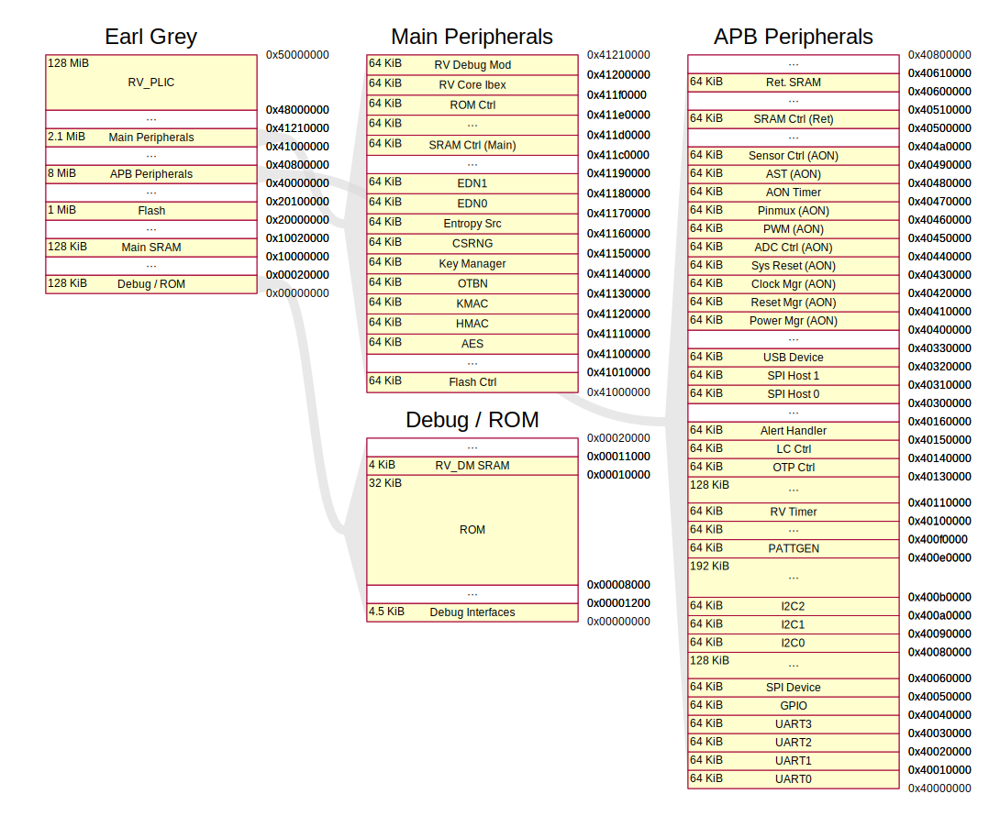
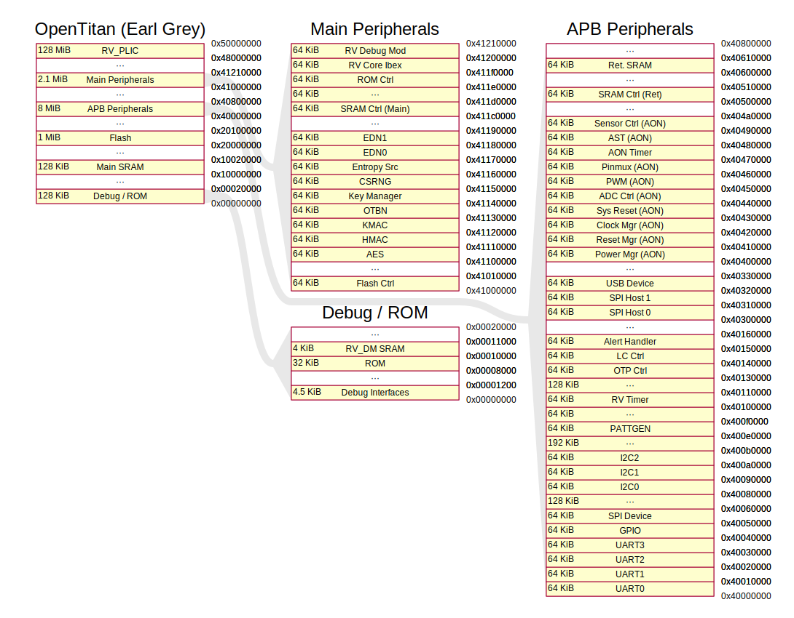
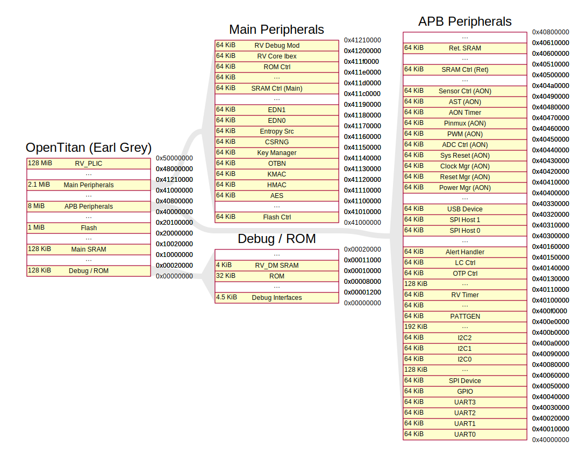

# 🚀 mmpviz (Memory Map / Address Map Visualizer): Publication-Quality Diagrams in Seconds

**Stop drawing memory map (or address map) diagrams by hand.** Datasheets use cramped tables. Hand-drawn diagrams go stale. Most drawing tools make you place every box manually. 

**mmpviz** is a zero-dependency Python tool that turns a simple JSON description of your memory layout into a stunning, structured SVG diagram. Just describe the address ranges, and let the layout engine do the heavy lifting. Perfect for datasheets, documentation, and presentations.

---

## ✨ Stunning Real-World Examples

mmpviz scales from simple microcontrollers to massive SoCs with dozens of peripherals.

### ARM CoreSight (Dual View)
A complex dual-initiator view showing connector links and multiple memory spaces, rendered with the default theme and layout.



> **Want to see more?** Check out the `examples/chips/` directory for massive SoCs like the following:
> * [**OpenTitan Earl Grey** (65+ peripherals)](examples/chips/opentitan_earlgrey/) — plantuml theme
> * [**PULPissimo** (4-level zoom)](examples/chips/pulpissimo/) — plantuml theme
> * [**Caliptra RoT**](examples/chips/caliptra/) — default theme
> * [**STM32F103**](examples/chips/stm32f103/) — plantuml theme

---

## 🧠 Auto-Layout Algorithms

You don't need to specify `x`, `y`, `width`, or `height`. mmpviz builds a containment graph and computes positions automatically. 

The tool provides a few layout choices to perfectly fit your canvas (from strict column assignment to advanced routing that rebalances columns and routes non-adjacent links through crossing-free bridge lines).

### OpenTitan Earl Grey: Layouts Compared (plantuml theme)

Here is how the massive OpenTitan SoC (65+ peripherals) looks across the different algorithms:

<table>
  <tr>
    <td align="center"><b>Algorithm 1</b></td>
    <td align="center"><b>Algorithm 2</b></td>
  </tr>
  <tr>
    <td></td>
    <td></td>
  </tr>
  <tr>
    <td align="center"><b>Algorithm 3 (Default)</b></td>
    <td align="center"><b>Algorithm 4</b></td>
  </tr>
  <tr>
    <td></td>
    <td></td>
  </tr>
</table>

*(Check out the `examples/chips/` directory for more examples! Each chip example includes individual layout SVGs for demonstration.)*

---

## 🤖 Supercharge Your AI Agents (Cursor, Claude, etc.)

**mmpviz is the perfect AI SKILL for your coding assistants.** 

Instead of asking an LLM to write raw SVG (which usually fails or looks terrible), give your agent the `mmpviz` skill. Your AI can easily generate a simple `diagram.json` based on your C headers, linker scripts, or hardware specs, and instantly compile it into a beautiful diagram.

### 1. Install the SKILL
The easiest way to add this skill to your AI agent (like Cursor) is using the skills CLI:
```bash
npx skills add f33lgood/mmpviz
```

**Manual Installation:**
If you prefer to install manually, clone the repository and link the `SKILL.md` file:
```bash
git clone https://github.com/f33lgood/mmpviz
ln -s "$(pwd)/mmpviz" ~/.claude/skills/mmpviz
```

### 2. Prompt your AI Agent
Once installed, you can trigger the skill with prompts like:

> *"Read my `linker.ld` script and use the mmpviz skill to generate a memory map diagram of my Flash and SRAM layout."*

> *"Here is the datasheet for my new peripheral. Use mmpviz to draw an SVG of its register map, using the PlantUML theme."*

See `SKILL.md` for full details on giving your AI agent the power of sight.

---

## 💻 CLI Quick Start

Prefer the command line? mmpviz has zero dependencies and can be installed directly via pip.

**1. Install via pip**
```bash
pip install mmpviz
```

**2. Run an example**
```bash
mmpviz -d diagram.json -o map.svg
```

**Manual Installation:**
If you prefer not to use pip, you can clone the repository and run the script directly (Python 3 stdlib only):
```bash
git clone https://github.com/f33lgood/mmpviz
cd mmpviz
python scripts/mmpviz.py -d examples/chips/stm32f103/diagram.json -o stm32.svg
```

---

## 📚 Reference Documentation

For the deep dive into schemas, themes, and layout mechanics:

*   [Step-by-step authoring guide](references/create-diagram.md)
*   [`diagram.json` Schema Reference](references/diagram-schema.md)
*   [`theme.json` Schema Reference](references/theme-schema.md)
*   [Auto-layout Algorithm Details](references/auto-layout-algorithm.md)
*   [Validation Rules](references/check-rules.md)

### Testing
```bash
python -m pytest tests/
```

---

## 🚀 Upcoming Release Actions (TODO)

We are currently preparing for our first major release! The following actions are planned:
- [ ] **GitHub Release**: Tag the repository (e.g., `v1.0.0`) and create a formal GitHub Release with a changelog.
- [ ] **PyPI Publication**: Publish the `mmpviz` package to PyPI so `pip install mmpviz` works globally.
- [ ] **SKILL Verification**: Verify that `npx skills add f33lgood/mmpviz` fetches the latest `SKILL.md` correctly after the release.